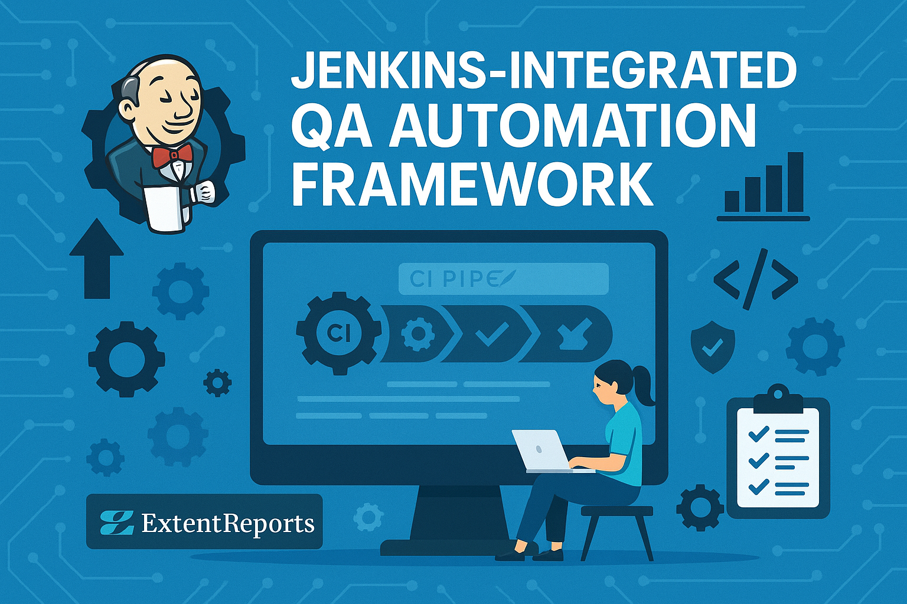

# 🚀 Jenkins-Integrated QA Automation Framework



## 📌 Overview

This is a **Selenium + TestNG + Maven** automation framework integrated with **Jenkins CI/CD**, designed to demonstrate a professional, scalable QA automation setup. The project currently focuses on:
- Jenkins integration to trigger test execution on push
- Grouped test execution (smoke, regression)
- HTML + ExtentReports generation
- Test result tracking

> ✅ Ideal for QA engineers looking to integrate automated testing into continuous integration pipelines.

---

## 🔧 Tech Stack

- **Language:** Java
- **Automation:** Selenium WebDriver
- **Test Framework:** TestNG
- **Build Tool:** Maven
- **Reporting:** ExtentReports (HTML)
- **CI/CD:** Jenkins
- **OS:** Works cross-platform (Windows/Linux/Mac)

---

## 📁 Project Structure

```
automation-pipeline/
│
├── src/
│   ├── main/
│   └── test/
│       ├── java/
│       │   ├── com.base/          # Base classes (setup/teardown)
│       │   ├── com.tests/         # Test classes
│       │   └── com.utils/         # Report managers & utilities
│
├── testng.xml                     # TestNG suite config
├── testng-smoke.xml               # Smoke TestNG  suite config
├── testng-regression.xml          # Regression TestNG suite config
├── pom.xml                        # Maven config
├── Jenkinsfile                    # Pipeline script (Declarative)
└── README.md                      # Project documentation
```

---

## 🧪 How to Run Locally

1. Clone the repo:
   ```bash
   git clone https://github.com/Tiger-a11y/automation-pipeline
   cd automation-pipeline
   ```

2. Run tests via Maven:
   ```bash
   mvn clean test
   ```

3. Reports will be generated under:
   ```
   /test-output/ExtentReport.html
   ```

---

## 🛠 Jenkins Integration

- ✅ Triggered on Git push (via SCM polling or Webhook)
- ✅ TestNG XML passed dynamically with group filtering
- ✅ Parallel execution enabled
- ✅ Console output + Report archiving
- ✅ Failure summary in build console

**Sample Jenkins Pipeline Stage:**
```groovy
pipeline {
    agent any

    environment {
        EMAIL_RECIPIENT = 'example@gmail.com'
        MAVEN_TOOL = 'Maven 3.8.8'
    }

    parameters {
        choice(name: 'TEST_SUIT', choices: ['smoke', 'regression'], description: 'Choose test suit')
    }

    tools {
        maven "${env.MAVEN_TOOL}"
    }

    stages {
        stage('Checkout') {
            steps {
                git url: 'https://github.com/Tiger-a11y/automation-pipeline', branch: 'main'
            }
        }

        stage('Set Env') {
            steps {
                script {
                    env.REPORT_LINK = "${env.BUILD_URL}allure"
                }
            }
        }

        stage('Run Tests') {
            steps {
                sh "mvn clean test -P${params.TEST_SUIT}"
            }
        }
    }
}
```

---

## 🌱 Future Enhancements

- 📧 Email notifications with test summary
- 📊 Allure Report integration with history
- 🧪 API testing module (RestAssured)
- 🔍 Cross-browser grid execution (Docker/Selenium Grid)
- 💬 Slack/Teams integration for test feedback

---

## 🤝 Contributions

Pull requests are welcome. Let’s improve this together!

---

## 📬 Contact

Have ideas or questions? [Connect on LinkedIn](https://www.linkedin.com/in/avinash-wagh101/) or [open an issue](https://www.linkedin.com/in/avinash-wagh101/issues).

---

> _This repo will eventually evolve into a full-blown QA solution covering UI, API, reporting, CI/CD, and test management._
